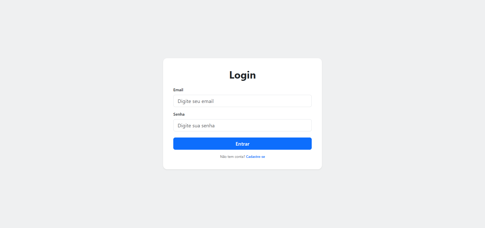

# Tela de Login - Bootstrap

**Aluno:** Henrique  
**Atividade:** Tela de login estática utilizando Bootstrap   
**Descrição:** Interface de login responsiva com campos de e-mail, senha, botão de entrar e link de cadastro, desenvolvida com HTML semântico e classes do Bootstrap.

